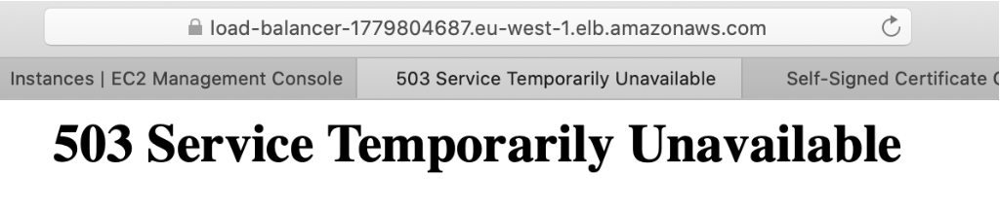

# CLOUD-COMPUTING-CLASS-2020-Lab6


## Q611. What happens when you use https://your-load-balancer-url instead of http://your-load-balancer-url ? Why does that happen? How could you fix it?

When using https, It’s just simply not working by showing page not respond and cannot open.
How to fixed it? By checking the listener tab below the load balancer screen, it shows The security group for your load balancer does not allow traffic on this listener port. So we add a new https rule to the security group .


After add a new https rule to current security group, we see the picture belowed that shows we can still enter the website by click Show Details (Common way when want to enter the not private https link)

 <p align="center"></p>

After we choose to enter the website, we can see the page shows that our instance( with id) alive.

 <p align="center"></p>


## Q612. Stop all three EC2 instances and wait approx. 5 minutes. What happens? Why?

It shows 503 Service Temporarily unavailable, this is because there’s no working instance for the load balancer
 <p align="center"></p>


## Q613. Terminate all three EC2 instances and wait approx. 5 minutes. What happens? Why?
The same error as the last question, and same reason that because the instance w attach to the load balancer is currently not working

## Q615. Create a piece of code (Python or bash) to reproduce the above steps required to launch a new set of web servers with a load balancer. Start using the AMI that you have already created.

```
#!/bin/bash

a=$(aws elbv2 create-load-balancer --name autoloadbalancer --type network --subnets subnet-b2380dfa)

lb_arn=$(echo "$a"| jq -r '.LoadBalancers[].LoadBalancerArn')
echo ${lb_arn}

b=$(aws elbv2 create-target-group --name my-targets --protocol TCP --port 80 --vpc-id vpc-3d55bc44)

tg_arn=$(echo "$b"| jq -r '.TargetGroups[].TargetGroupArn')
echo ${tg_arn}

aws elbv2 register-targets --target-group-arn ${tg_arn} --targets Id=i-0f67783318e3027b8 Id=i-0f7f7e30891485742\

aws elbv2 create-listener --load-balancer-arn ${lb_arn} --protocol TCP --port 80 --default-actions Type=forward,TargetGroupArn=${tg_arn}

```

## Q621. What is the list of events that the above URL triggers?
When we put ?TableName=shopping-list at the end URL it return us information about a table name shopping-list in dynamodb, same idea if we put ?TableName=gsg-signup-table it return as information aobut the dynamodb we created 2 weeks ago. Inside the page, we can see the items that in the requested table and when did the table create.

## Q622. Does the reply of the above URL match what it should be expected? Why?
https://f0h43fef16.execute-api.eu-west-1.amazonaws.com/default/serverless-controller?TableName=shopping-list shows as what we expected. We add one new item in dynamodb that we created to see if we can see it in the website that URL return and the answer is yes as follow.


## Q623. Explain what happens (actions and parts activated) when you type the URL in your browser to obtain the page updated with the shopping list.
When access the page using index.html, we can see it comes with the css decoration and because of the ``` <link href="styles.css" rel="stylesheet">``` that connect it with the style.css file inside S3 bucket, also when it use ```<script src="script.js"></script>``` to enable the index.html to connect to the dynamodb.


## Q624. Explain what happens (actions and parts activated) when you type a new item in the New Thing box.
At first we got error because the key of shopping list that we used is email however it should be thingid as correspond to the script.js that use get and post functions. After debug, the data we input can sucessfully put to the shopping list and will also trigger the get function of the js file to show the item in the database as the list

 <p align="center"></p>

Then we can also check it through our lambda API endpoint, and see if the item were successfully added to the database.


## Q625. Have you been able to debug the code of the Lambda function? If the answer is yes, check that you are using the root API keys. Erase such keys and create a new testing user with the required permissions.


## Q626. What are the minimum permissions that the user's API keys needs to execute the Lambda function locally?


## Q627. Create a piece of code (Python or bash) to reproduce the above steps required to launch a new AWS Lambda function and AWS API gateway.


