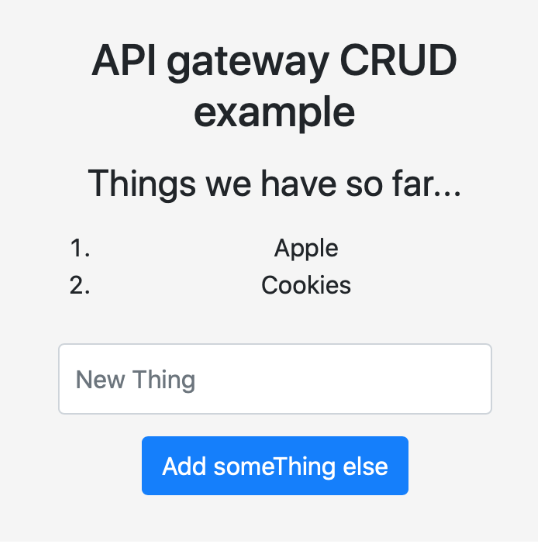
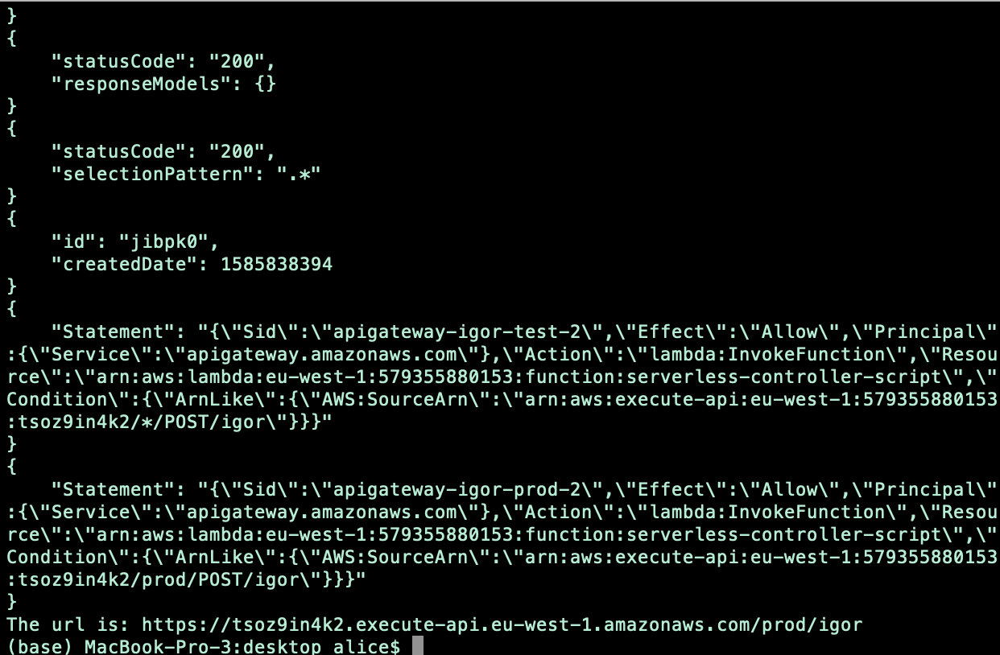

# CLOUD-COMPUTING-CLASS-2020-Lab6

## Task 6.1:Test your new system 
## Q611. What happens when you use https://your-load-balancer-url instead of http://your-load-balancer-url ? Why does that happen? How could you fix it?

When using https, It’s just simply not working by showing page not respond and cannot open.
How to fixed it? By checking the listener tab below the load balancer screen, it shows The security group for your load balancer does not allow traffic on this listener port. So we add a new https rule to the security group .


After add a new https rule to current security group, we see the picture below that shows we can still enter the website by click Show Details (Common way when want to enter the not private https link)

 <p align="center"></p>

After we choose to enter the website, we can see the page shows that our instance( with id) alive.

 <p align="center"></p>


## Q612. Stop all three EC2 instances and wait approx. 5 minutes. What happens? Why?

The two instance created with **auto scalling group** immediately created another running instance whereas the **apache-web-server** EC2 Instance was stopped.This is due to the the feature of auto scalling group which lets the instance to be in the running state  after we manually forced them to stop.  


## Q613. Terminate all three EC2 instances and wait approx. 5 minutes. What happens? Why?

The same reasoning as before the two EC2 instances created using **auto scalling group** are still running after 5 minute, whereas the **apache-web-server**  instance terminated comppletely<br/>

## Q614. How are you going to end this section regarding the use of AWS resources?


## Q615. Create a piece of code (Python or bash) to reproduce the above steps required to launch a new set of web servers with a load balancer. Start using the AMI that you have already created.

```
#!/bin/bash

a=$(aws elbv2 create-load-balancer --name autoloadbalancer --type network --subnets subnet-b2380dfa)

lb_arn=$(echo "$a"| jq -r '.LoadBalancers[].LoadBalancerArn')
echo ${lb_arn}

b=$(aws elbv2 create-target-group --name my-targets --protocol TCP --port 80 --vpc-id vpc-3d55bc44)

tg_arn=$(echo "$b"| jq -r '.TargetGroups[].TargetGroupArn')
echo ${tg_arn}

aws elbv2 register-targets --target-group-arn ${tg_arn} --targets Id=i-0f67783318e3027b8 Id=i-0f7f7e30891485742\

aws elbv2 create-listener --load-balancer-arn ${lb_arn} --protocol TCP --port 80 --default-actions Type=forward,TargetGroupArn=${tg_arn}

```
## Task 6.2 Serverless example 
## Q621. What is the list of events that the above URL triggers?

When we put ?TableName=shopping-list at the end URL it returns us information about a table name shopping-list in dynamodb, same idea if we put ?TableName=gsg-signup-table it return as information aobut the dynamodb we created 2 weeks ago. Inside the page, we can see the items that in the requested table and when did the table create.

Therefore, as we understood from the lamda function and the general configuration we made the given URL Interacts with the shopping-list DynamoDB table by the using the roles defined inside the **serverless-controller-role**. In addition to that, the URL  Invokes the API gateway which serves as HTTP endpoint to display feteched results in the form of JSON or raw data.<br/> 

## Q622. Does the reply of the above URL match what it should be expected? Why?
https://f0h43fef16.execute-api.eu-west-1.amazonaws.com/default/serverless-controller?TableName=shopping-list shows as what we expected.<br/>
 At the very beginning, we were not 100% sure about what the given URL was invoking but later when we insert an item into the DynamoDB table using the static website to see if we can see it in the website that URL returns<br/>


## Q623. Explain what happens (actions and parts activated) when you type the URL in your browser to obtain the page updated with the shopping list.
When access the page using index.html, we can see it comes with the css decoration and because of the ``` <link href="styles.css" rel="stylesheet">``` that connect it with the style.css file inside S3 bucket, also when it use ```<script src="script.js"></script>``` to enable the index.html to connect to the dynamodb.


## Q624. Explain what happens (actions and parts activated) when you type a new item in the New Thing box.
At first we got error because the key of shopping list that we used is email however it should be thingid as correspond to the script.js that use get and post functions. After debug, the data we input can sucessfully put to the shopping list and will also trigger the get function of the js file to show the item in the database as the list

 <p align="center"></p>

Then we can also check it through our lambda API endpoint, and see if the item were successfully added to the database.


## Testing and debugging 

## Q625. Have you been able to debug the code of the Lambda function? If the answer is yes, check that you are using the root API keys. Erase such keys and create a new testing user with the required permissions.

**Yes**, we are able to debug and run it locally. Using **aws configure list** we checked that we were using **root API keys**. 

- We created another user with a full access to the shopping-list Dynamo table. 
- we erased the previous root api keys
- We configure the aws cli with the new user credetials
- We run the lambda function with the new user and it runs succeffuly. 


## Q626. What are the minimum permissions that the user's API keys needs to execute the Lambda function locally?

The minimum requirements to run the lambda function locally are to give read and write permission to the new user.

## Q627. Create a piece of code (Python or bash) to reproduce the above steps required to launch a new AWS Lambda function and AWS API gateway.

Pre-request for the following code: 
1. Role with enough permission created (here we used the role we create earlier)
2. lambda.py created (handler)

```
#!/bin/bash

#create lambda function
REGION="eu-west-1"
NAME="serverless-controller-script"
APINAME="api-test"
LAMBDAARN=$(echo $(aws lambda create-function --function-name ${NAME} --zip-file fileb://lambda.py.zip --role serverless-controller-role --handler lambda.lambda_handler --runtime python3.7 --role arn:aws:iam::579355880153:role/service-role/serverless-controller-role) | jq -r '.FunctionArn')

#create api
APIID=$(echo $(aws apigateway create-rest-api --name "${APINAME}" --description "Api for ${NAME}" --region ${REGION})| jq -r '.id')
PARENTRESOURCEID=$(echo $(aws apigateway get-resources --rest-api-id ${APIID})| jq -r '.items[].id')
RESOURCEID=$(echo $(aws apigateway create-resource --rest-api-id ${APIID} --parent-id ${PARENTRESOURCEID} --path-part igor --region ${REGION})| jq -r '.id')

#Itegration
aws apigateway put-method --rest-api-id ${APIID} --resource-id ${RESOURCEID} --http-method POST --authorization-type NONE --region ${REGION}
aws apigateway put-integration --rest-api-id ${APIID} --resource-id ${RESOURCEID} --http-method POST --type AWS --integration-http-method POST --uri arn:aws:apigateway:${REGION}:lambda:path/2015-03-31/functions/${LAMBDAARN}/invocations --request-templates '{"application/x-www-form-urlencoded":"{\"body\": $input.json(\"$\")}"}' --region ${REGION}
aws apigateway put-method-response --rest-api-id ${APIID} --resource-id ${RESOURCEID} --http-method POST --status-code 200 --response-models "{}" --region ${REGION}
aws apigateway put-integration-response --rest-api-id ${APIID} --resource-id ${RESOURCEID} --http-method POST --status-code 200 --selection-pattern ".*" --region ${REGION}
aws apigateway create-deployment --rest-api-id ${APIID} --stage-name prod --region ${REGION}
APIARN=$(echo ${LAMBDAARN} | sed -e 's/lambda/execute-api/' -e "s/function:${NAME}/${APIID}/")
aws lambda add-permission --function-name ${NAME} --statement-id apigateway-igor-test-2 --action lambda:InvokeFunction --principal apigateway.amazonaws.com --source-arn "${APIARN}/*/POST/igor" --region ${REGION}
aws lambda add-permission --function-name ${NAME} --statement-id apigateway-igor-prod-2 --action lambda:InvokeFunction --principal apigateway.amazonaws.com --source-arn "${APIARN}/prod/POST/igor" --region ${REGION}

echo "The url is: https://${APIID}.execute-api.${REGION}.amazonaws.com/prod/igor"
```

<p align="center"></p>
<p align="center"></p>


### Challenges 
1. 	**AWS Load Balancer-503 services temporarily unavailable**<br/>
**Reason**: The target groups for the load balancer had no registered targets

Using load balancer target group we register **apache-web-server**  EC2 Instance to be used by **primary-apache-web-server-target**

2. **Error when we add data to the shopping list using the static web site we created**<br/>
**Reason**: Existing shopping-list table primary Key(email) and thingid in the scripts.js and index.html was not matched 
**Solutions**: Modifying the shopping-list table primary key with thingid instead of email to match with the **thingid** field in the script.js and index.html 

3. **DynamoDB Access Denied**<br/>
User was not allowed to scan, delete, update, and insert data to the DynamoDB shopping-list table when lambda_handler (event, context) function was invoked.**<br/>
**Solution**:modify the user permission with **AmazonDynamoDBFullAccess** to give a full access to DynamoDB table 
4. Unable to create **apache-web-server** instance with 8 GiB SSD.<br/>

We tried many times with different settings but was not successfully to lunch the instance with less than 50 GiB Solid State Drive.
**Solution**: Finally, We forced to  use the defualt 50 GiB to lunch the instance.

5. Unable to login to the  Ec2 instance using ssh -1 "configureation.pem" root@ec-domain using the root account

   **Solution**:We use ssh - i **ubuntu@ec2-instance-domain** instead of ssh -i **root@ec2-instance-domain**


